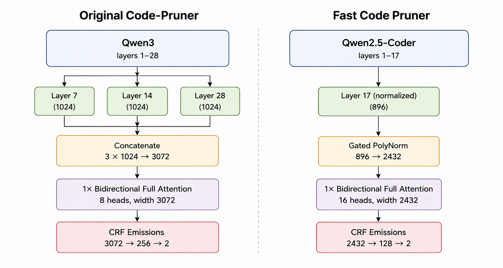
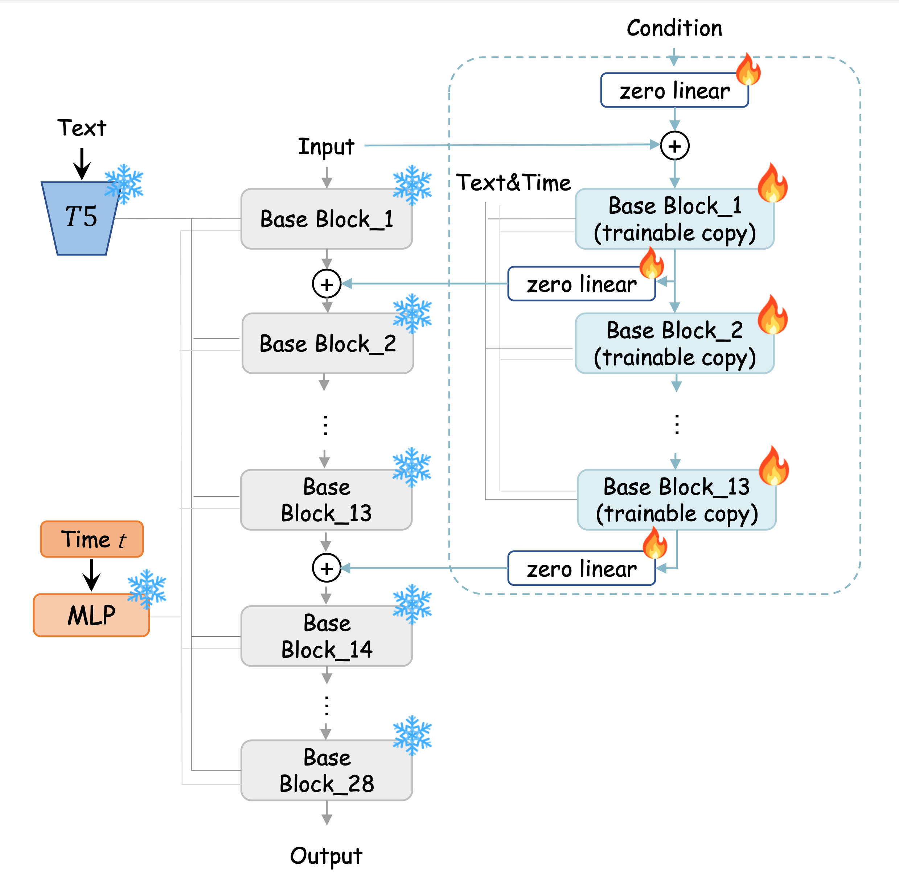
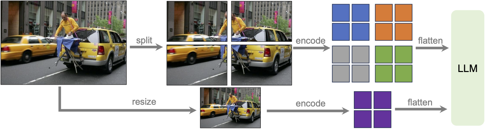
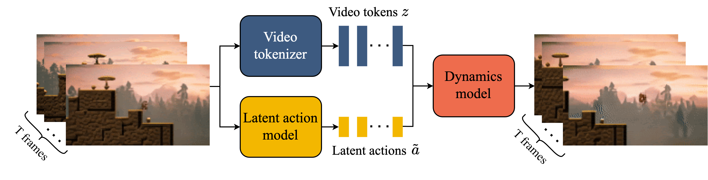
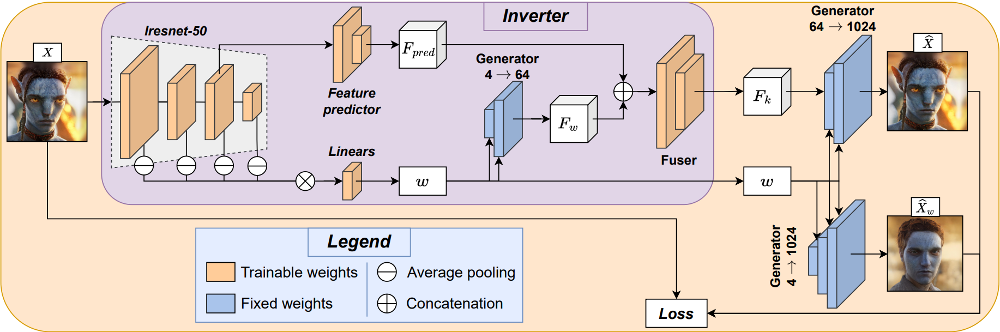

# Rotem Israeli — Research Engineer

  

I build multimodal and efficient AI systems across code generation, vision-language modeling, audio, video, and on-device inference. My work spans model training, reinforcement learning, evaluation, and production serving.

## Professional Experience

### Multimodal AI Research Engineer at Idomoo

- Built multimodal training and evaluation pipelines for code-generation and screenshot-to-webpage models using LoRA, vLLM, structured-output validation, and LLM-as-judge evaluation.
- Developed reward-modeling and GRPO-style RL workflows for webpage aesthetics and layout quality.
- Built and optimized production inference with vLLM and vLLM-Omni across LLM, image, and video workloads.

### Conversational AI Engineer at NLPearl

- Built real-time pause detection and starter-suggestion systems with fine-tuned LLMs.
- Explored encoder and decoder architectures with LoRA and multi-stage training.
- Designed an SLM that generates task-specific tokens for efficient multi-task inference.

### Machine Learning Engineer at Israeli Navy

- Adapted vision and audio models for sonar and signal-processing tasks, including EnCodec/WavTokenizer-style representations.
- Trained self-supervised and semi-supervised objectives on large unlabeled sonar and audio datasets using masked autoencoding, JEPA, and contrastive learning.

## Personal Projects

### Fast Code Pruner ⚡

Task-aware context pruning for coding agents, built on a 17-layer Qwen2.5-Coder-0.5B backbone with a native vLLM serving path. The pruner uses the normalized final-layer representation, removes three unnecessary attention branches, and merges rank-8 LoRA updates into dense weights during export.

<picture>
  <source type="image/webp" media="(prefers-color-scheme: dark)" srcset="images/code_pruner_architecture_dark.webp">
  <source media="(prefers-color-scheme: dark)" srcset="images/code_pruner_architecture_dark.png">
  
</picture>

#### Architecture highlights

- Qwen2.5-Coder layers 1–17 with a normalized 896-dimensional final representation.
- Gated PolyNorm expands 896 → 2432 before one bidirectional fusion-attention block.
- CRF emissions reduce 2432 → 128 → 2 for line-level keep/prune decisions.

#### Validation quality

| Model | Accuracy ↑ | Precision ↑ | Recall ↑ | F1 ↑ |
| --- | ---: | ---: | ---: | ---: |
| **fast-code-pruner** | **85.94%** | **81.49%** | **83.49%** | **82.48%** |
| code-pruner | 84.07% | 80.02% | 80.91% | 80.46% |

#### Serving performance

| Model | Backend | Concurrency 1 ↑ | Concurrency 16 ↑ |
| --- | --- | ---: | ---: |
| **fast-code-pruner** | **vLLM 0.27.0** | **85.0 req/s** | **214.4 req/s** |
| fast-code-pruner | Hugging Face | 16.01 req/s | 16.03 req/s |
| code-pruner | Hugging Face | 9.83 req/s | 10.03 req/s |

### ControlNet for Diffusion Transformers 🎨

- Built a ControlNet-like module for fine-grained text-to-image control, extending ControlNet-XS.
- Outperformed Sana’s ControlNet baseline across all metrics.
- Injected conditioning with zero-convolution layers to preserve pretrained features.
- Engineered efficient training with lazy loading and a reduced memory footprint.

<picture>
  <source type="image/webp" media="(prefers-color-scheme: dark)" srcset="images/controlnet_architecture_dark.webp">
  <source media="(prefers-color-scheme: dark)" srcset="images/controlnet_architecture_dark.png">
  
</picture>

| Model | FID (↓) | LPIPS (↓) | SSIM (↑) | CLIP ↑ | CLIP Aesthetic ↑ |
| --- | ---: | ---: | ---: | ---: | ---: |
| ControlNet | 38.78 | 0.37 | 0.33 | 0.341 | 11.42 |
| **ControlNet-XS** | **34.38** | **0.30** | **0.43** | **0.344** | **12.39** |

[ControlNet demonstration video](videos/controlnet.mp4)

### Visual Question Answering 🔍

- Developed a VQA pipeline inspired by LLaVA: vision encoder → connector → language model.
- Staged training: trained the connector first, then LoRA-fine-tuned the language model.
- Bench-tested SigLIP, MobileCLIP, DINOv2, and EfficientSAM for robust visual features.
- Added dynamic high-resolution processing through LLaVA-NeXT and the `s²` wrapper.
- Compared Gemma, Qwen, SmolLM, and OpenELM for answer quality.

<picture>
  <source type="image/webp" media="(prefers-color-scheme: dark)" srcset="images/llava_next_dark.webp">
  <source media="(prefers-color-scheme: dark)" srcset="images/llava_next_dark.png">
  
</picture>

### World Model à la Google Genie 🧞

- Built a Frame Tokenizer → Latent Action Model → Dynamics Model pipeline.
- Used EfficientViT and MobileStyleGAN for fast tokenization and decoding.
- Replaced Genie’s ST-Transformer with a quantized lightweight MLP.
- Explored real-time simulation with compact visual representations and action models.

<picture>
  <source type="image/webp" media="(prefers-color-scheme: dark)" srcset="images/genie_architecture_dark.webp">
  <source media="(prefers-color-scheme: dark)" srcset="images/genie_architecture_dark.png">
  
</picture>

[World-model demonstrations](videos/pacman1_resized.mp4) · [Example 1](videos/genie_example1.mp4) · [Example 2](videos/genie_example2.mp4) · [Example 3](videos/genie_example3.mp4)

### Mobile Face Transformation App 📱

- 🏆 First place at the Samsung Next MobileXGenAI Hackathon with real-time 30 fps face transformations on mobile.
- Built custom encoders that inject facial features at multiple StyleGAN decoder layers.
- Combined pixel, perceptual, and adversarial losses for robust, identity-preserving edits.
- Used MobileStyleGAN, EfficientFormer, and CLIP for a fully on-device pipeline.
- Supported both `w`-latents and `F`-latents for flexible facial attribute manipulation.

[Celebrity Look Transformation video](videos/celebrityLook.mp4)

<picture>
  <source type="image/webp" media="(prefers-color-scheme: dark)" srcset="images/stylegan_inversion_dark.webp">
  <source media="(prefers-color-scheme: dark)" srcset="images/stylegan_inversion_dark.png">
  
</picture>
