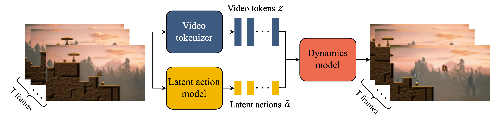

# Rotem Israeli - Research Engineer

   

## Projects

### Visual Question Answering 🔍

- Developed a Visual Question Answering (VQA) system by combining vision models, a connector for visual-text alignment, and a language model, inspired by LLaVA.
- First trained the connector and then fine-tuned the language model using LoRA.
- Optimized feature extraction by experimenting with and combining multiple vision models, including SigLIP, MobileCLIP, DINOv2, and EfficientSAM.
- Enhanced visual representations through dynamic high-resolution processing with LLaVA-NeXT and the s² wrapper.
- Evaluated multiple language models (Gemma, Qwen, SmolLM, OpenELM) to improve response accuracy and system performance.

### World Model Inspired by Google's Genie 🧞

- Built an efficient world model with three components: Frame Tokenizer for visual feature extraction, Latent Action Model for inferring actions, and Dynamics Model for predicting future frames.
- Used EfficientViT for tokenizing images into discrete latents, then decoded them into continuous features with MobileStyleGAN.
- Replaced Genie's ST-Transformer with a lightweight MLP to infer actions between frame pairs and applied quantization to latent frames.
- Experimented with and replaced various components to enable real-time simulation, finding that a lightweight MLP performs similarly to large transformers, and working on the image level with EfficientViT and MobileStyleGAN exponentially increased speed.

### Mobile Face Transformation and Manipulation App 📱

- Developed a real-time face transformation app using MobileStyleGAN, EfficientFormer, CLIP, and StyleGAN2.
- Trained an encoder to inject facial features at various stages of the StyleGAN decoder, creating a detailed transformation pipeline optimized for CoreML, achieving 30fps on mobile devices.
- Contributed to the app's success at the MobileXGenAI Hackathon hosted by Samsung Next.
- Combined multiple losses from foundation models and facial feature extractors to ensure high-quality transformations.

#### Video Demonstration

- [Celebrity Look Transformation](videos/celebrityLook.mp4)

*I implemented the training pipeline described in [arxiv.org/abs/2406.10601](https://arxiv.org/abs/2406.10601), which allows for high-quality reconstruction of fine image details while preserving editability by utilizing both w-latents and F-latents, ensuring effective manipulation of real image attributes even in challenging cases.*

---

## Professional Experience

### Research Engineer at nlpearl.ai

- Developed real-time systems to detect conversational pauses and suggest optimal starter sentences for AI agents using fine-tuned LLMs with specialized prediction heads.
- Experimented with various architectures, including encoder-based and decoder-pretrained models, applying LoRA and multi-stage training to enhance prediction accuracy.
- Designed a small language model (SLM) to generate task-specific tokens, enabling multi-task outputs from a single fine-tuned model for efficient real-time inference.

### Research Engineer at Israeli Navy

- Led long-term research initiatives focused on adapting foundation models, such as EnCodec and WavTokenizer, to sonar and audio data, employing multi-stage training, freezing layers, and fine-tuning with LoRA for task-specific optimizations.
- Prioritized large-scale research and development efforts while collaborating on additional projects across the department.
- Trained self-supervised models, including masked autoencoders, on large amounts of unlabeled audio data and spectrograms, with a focus on scaling solutions for real-world sonar applications.
- Applied semi-supervised learning, pseudo-labeling, and mixup techniques to improve model generalization, especially with limited labeled data.
- Developed expert ensembles and distilled them into student models, significantly improving robustness and inference efficiency in production environments.
- Spearheaded extensive data cleaning and preprocessing workflows to address noise and inconsistencies, ensuring high data quality for critical sonar operations.
- Utilized neural architecture search to optimize models for specific sonar and audio tasks, with a focus on performance improvements through RBF-KAN for final layers and linear layers elsewhere.
- Integrated state-of-the-art techniques from leading research papers and Kaggle competition winners to tackle complex sonar challenges, contributing to strategic advancements in military research.

---
